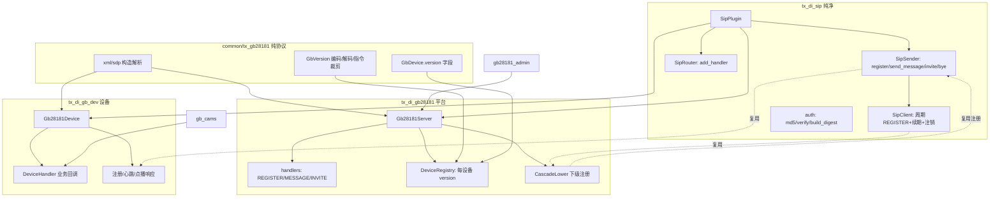

## 用户需求与决策

用户确认国标 GB28181 的分层架构，并拍板 4 项决策：

1. **gb_dev 为独立 crate，同时是一个插件**：新建 `plugins/tx_di_gb_dev`，以 DI 组件形式支撑设备端 `gb_cams`，并提供版本开关。
2. **GbVersion 粒度为每设备**：平台同时对接 2016 与 2022 设备，每个对端独立持有版本属性，支持混合组网（非全局单一版本）。
3. **摘要认证从 `tx_gb28181::utils` 下沉到 `tx_di_sip`**：`md5_digest`/`md5_hex`/`generate_nonce`/`verify_digest_auth` 及客户端 Authorization 构造迁至 L0，common 库使用方调整 import。
4. **先搭 gb_dev 框架，再迁移**：优先产出 gb_dev 骨架（组件 + DeviceHandler + 注册/响应），然后再做 gb_cams 完整迁移。

## 核心功能

- 建立四层结构：`L0 tx_di_sip`（纯净 SIP 栈，零 GB 语义）/ `L1 common/tx_gb28181`（纯国标协议：XML/SDP/编解码/指令集/版本策略）/ `L2a tx_di_gb28181`（平台服务端，支撑 gb28181_admin）/ `L2b tx_di_gb_dev`（设备客户端，支撑 gb_cams，供级联复用）。
- `tx_di_sip` 新增 `auth` 模块（摘要认证）与 `SipClient` 组件（周期性 REGISTER + 续期 + 注销），复用 `SipSender::register` 的自动 401 重认证，消除各上层重复实现。
- `common/tx_gb28181` 新增 `GbVersion{V2016,V2022}`：驱动出网 XML 字符集（GB2312/GB18030）、字节编解码、指令集按版本裁剪，并在 `GbDevice` 增加 `version` 字段。
- 平台侧支持每设备版本：配置兜底 + 注册时探测 + 向设备下发前按版本编码与裁剪指令（修复 2016 设备乱码真 bug）。
- `tx_di_gb_dev`：`Gb28181Device` 组件（向上注册/心跳/点播响应/查询响应）+ `DeviceHandler` 业务回调 trait + 版本开关，供 gb_cams 与平台级联（CascadeLower）复用。
- gb_cams 去掉裸 rsipstack，改为依赖 `tx_di_gb_dev` 并实现 `DeviceHandler`，保留虚拟设备/媒体/UI 业务层。
- 级联下级（CascadeLower）复用 L0/L2b 注册能力，删除手写 nonce 重试与重复 Catalog 逻辑。
- P2 互通加固：SDP NAT rewrite 中间件、国标场景 transport 默认 Both、in-dialog 关联助手、双向 TLS。

## 技术栈

| 组件 | 选型 | 说明 |
| --- | --- | --- |
| L0 SIP 认证 | 现有内联 MD5 实现（迁移，无新依赖） | `tx_di_sip` 已含 `rand`，MD5 在 utils 内联，迁移零新 crate |
| L0 SipClient | 复用 `SipSender::register`（rsipstack `Credential` 自动 401） | 周期续期 + 注销，通用注册生命周期 |
| L1 版本/编解码 | `encoding_rs`（common 已有） | 按版本序列化 GB2312/GB18030 字节、容错解码 |
| L2b gb_dev | 依赖 `tx_di_sip` + `tx_gb28181` | 复用 SipSender 注册与 DialogLayer 服务端 INVITE |
| 测试 | [skill:rust-ddd-test-generator] | 各阶段单测/集成测试 |


## 实现策略

按"L0 基础 → L1 双版本 → L2a 平台每设备版本 → L2b gb_dev 框架 → gb_cams 迁移 → 复用收尾"推进。关键决策：

- **SIP 纯净性**：`tx_di_sip` 不引入任何 GB 语义；`SipClient` 只负责 REGISTER 生命周期，GB 心跳 MESSAGE 由 L2b 用 `SipSender::send_message` 自管，保持 L0 通用。
- **双版本建模**：`GbVersion` 位于 L1，出网 XML builder 保持内部 GB18030 默认；平台侧经 `GbVersion::serialize(xml)` 统一做"声明替换 + 字节重编码"，避免改动约 50 个 builder 签名（最小爆炸半径、正确性等价）。
- **每设备版本**：`GbDevice.version` 为真相源；平台下发前 `version.serialize(xml)` 并按 `Gb28181CmdType::is_supported(version)` 裁剪 2022 专有指令。
- **gb_dev 框架优先**：先交付 `Gb28181Device` 组件 + `DeviceHandler` trait（含默认实现与事件），gb_cams 仅实现 trait 即可，业务层零改造。

## 架构设计



数据流（设备侧）：`Gb28181Device` 经 `SipClient`/`SipSender` 向上注册 → 收到 INVITE/MESSAGE → 经 `DeviceHandler` 取业务数据 → `GbVersion::serialize` 编码回网。

## 目录结构

```
新增 plugins/tx_di_gb_dev/                       # [NEW] 设备端插件 crate（workspace member）
├── Cargo.toml                                    # [NEW] deps: tx-di-core, tx_di_sip, tx_gb28181, tokio, dashmap, serde, encoding_rs
└── src/
    ├── lib.rs                                    # [NEW] 模块声明 + 公开导出 Gb28181Device/DeviceHandler/GbDevConfig
    ├── config.rs                                 # [NEW] GbDevConfig（platform_uri/device_id/username/password/realm/register_ttl/heartbeat_secs/version）
    ├── plugin.rs                                 # [NEW] Gb28181Device 组件（app_async_init 注册 handler + 启动注册/心跳；shutdown 注销）
    ├── register.rs                               # [NEW] 复用 SipSender.register 的注册+续期循环 + Keepalive MESSAGE（按 version 编码）
    ├── handler.rs                                # [NEW] DeviceHandler trait（目录/设备信息/状态/点播/PTZ/BYE 回调）+ 默认路由
    └── invite.rs                                 # [NEW] 作为 UAS 收 INVITE，DialogLayer server invite 生成 SDP answer（复用 tx_gb28181::sdp）

修改 plugins/tx_di_sip/src/
├── lib.rs                                        # [MODIFY] 声明 pub mod auth; pub mod client;
├── auth.rs                                       # [NEW] 从 common/tx_gb28181::utils 迁入 md5_digest/md5_hex/generate_nonce/verify_digest_auth + build_digest_authorization/extract_nonce
└── client.rs                                     # [NEW] SipClient 组件（conf=SipClientConfig, app_async_run 续期循环 + 注销）

修改 common/tx_gb28181/
├── Cargo.toml                                    # [MODIFY] 删除 utils 依赖声明（若独立）
├── src/lib.rs                                    # [MODIFY] 新增 pub mod version; 删除 pub mod utils;
├── src/utils.rs                                  # [DELETE] 实现迁至 tx_di_sip::auth
├── src/version.rs                                # [NEW] GbVersion 枚举 + encoding()/serialize()/decode()/is_supported_for(CmdType)
└── src/device.rs                                 # [MODIFY] GbDevice 增加 pub version: GbVersion（默认 V2022）

修改 plugins/tx_di_gb28181/
├── src/crypto.rs                                 # [MODIFY] re-export 改自 tx_di_sip::auth
├── src/auth.rs                                   # [MODIFY] verify_digest_auth import 改自 tx_di_sip::auth
├── src/config.rs                                 # [MODIFY] Gb28181ServerConfig 增加 device_versions: HashMap<String,GbVersion> + default_version
├── src/device_registry.rs                        # [MODIFY] register/register_batch 保留 version 字段
├── src/cascade.rs                                # [MODIFY] 注册改用 SipSender.register（删手写 build_digest_auth/extract_nonce）；Catalog 按上级版本编码
└── src/handlers.rs                               # [MODIFY] REGISTER 探测并写入 GbDevice.version；下发 XML 用 version.serialize

修改 examples/gb_cams/
├── Cargo.toml                                    # [MODIFY] 增加 tx_di_gb_dev 依赖，移除对 rsipstack 直接裸用（仅留业务需要）
└── src/device/*.rs                               # [MODIFY] 删除 manager.rs 裸 Endpoint/Transaction/Registration 逻辑，改为实现 tx_di_gb_dev::DeviceHandler + 注入 Gb28181Device

修改 Cargo.toml (workspace)                       # [MODIFY] members 增加 plugins/tx_di_gb_dev
```

## 关键代码结构

```rust
// common/tx_gb28181/src/version.rs
#[derive(Debug, Clone, Copy, PartialEq, Eq, Default, serde::Deserialize, serde::Serialize)]
#[serde(rename_all = "lowercase")]
pub enum GbVersion { #[default] V2022, V2016 }

impl GbVersion {
    pub fn encoding(&self) -> &'static str { /* V2016->"GB2312", V2022->"GB18030" */ }
    /// 将 GB18030 内部 XML 按本版本重新声明字符集并编码为字节
    pub fn serialize(&self, xml: &str) -> Vec<u8> { /* replace encoding + encoding_rs */ }
    /// 容错解码入网字节（优先 GB18030，失败回退 GB2312）
    pub fn decode(bytes: &[u8]) -> String { /* encoding_rs */ }
}

// plugins/tx_di_gb_dev/src/handler.rs
#[async_trait::async_trait]
pub trait DeviceHandler: Send + Sync + 'static {
    async fn on_catalog(&self, sn: u32) -> Vec<(String, String)>; // (channel_id, name)
    async fn on_device_info(&self, sn: u32) -> String;            // 业务自定义 Response XML
    async fn on_device_status(&self, sn: u32) -> String;
    async fn on_invite(&self, channel_id: &str, sdp_offer: &str) -> String; // SDP answer
    async fn on_bye(&self, call_id: &str);
    async fn on_ptz(&self, channel_id: &str, cmd: &tx_gb28181::xml::PtzCommand);
}

// plugins/tx_di_sip/src/client.rs
#[derive(Debug, Clone, serde::Deserialize, Component)]
#[component(conf = "sip_client")]
pub struct SipClientConfig {
    pub registrar: String, pub username: String, pub password: String,
    pub realm: Option<String>, pub expires: u32, pub renew_secs: u32, #[serde(default)] pub enabled: bool,
}
```

## 实现注意

- **迁移安全性**：digest 迁移后，用 [subagent:code-explorer] 全仓搜索 `tx_gb28181::utils`/`utils::md5` 确认仅 `tx_di_gb28181` 三处引用，统一改 import；`common` 内部模块无 md5 依赖，可删 `utils.rs`。
- **编码正确性**：2016 设备必须"声明 GB2312 + 字节按 GB2312 编码"，不能仅改声明；`serialize` 用 `encoding_rs` 真编码，避免中文乱码。
- **向后兼容**：`Gb28181ServerConfig` 新增字段均有 `#[serde(default)]`，不影响现有 gb28181_admin 配置；`tx_di_gb28181` 的 xml/sdp re-export 不变。
- **L0 纯净**：`SipClient` 不感知 GB；GB 心跳内容由 L2b 通过 `SipSender::send_message` 发送，L0 仅提供注册生命周期原语。
- **性能**：版本编码为 O(n) 字符串替换 + 编码，仅在出网时一次；`GbDevice.version` 读为内存字段，无额外开销。
- **测试**：各阶段 `cargo build` + `cargo test`；auth 覆盖 MD5 向量/verify/build；GbVersion 覆盖编码切换/指令裁剪/解码容错；gb_dev 集成测试用 fake 上级验证 REGISTER+Keepalive+Catalog 响应；回归 gb28181_admin 平台链路。

## Agent Extensions

### Skill

- **rust-ddd-test-generator**
- 用途：为各阶段产出生产级测试——L0 auth（md5 向量、verify_digest_auth、build_digest_authorization）、SipClient 注册续期；L1 GbVersion（编码切换、指令裁剪、解码容错）；L2b gb_dev（fake 上级 REGISTER+Keepalive+Catalog 响应集成测试）；迁移后 gb_cams 回归。
- 预期产出：覆盖公共 API、领域值对象（GbVersion/GbDevice）、组件（SipClient/Gb28181Device）、事件回调（DeviceHandler）的完整测试套件，确保零警告通过 cargo test。

### SubAgent

- **code-explorer**
- 用途：迁移摘要认证时全仓搜索 `tx_gb28181::utils`/`utils::md5`/`verify_digest_auth`/`generate_nonce` 的全部引用点；以及搜索 `tx_di_gb28181` 中调用 `build_*_xml` 的出网点，确保全部接入 `GbVersion::serialize`。
- 预期产出：精确的调用点清单，避免迁移遗漏 import 或漏改编码，保证编译一次通过。