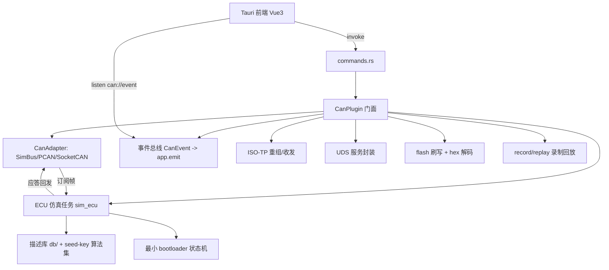

## 用户需求

用户当前无 CAN/CAN-FD 硬件设备，需要在"无设备"条件下完整联调并使用 CAN 诊断上位机（监控 / UDS 诊断 / 固件刷写），并实现文档 `REQUIREMENTS.md` 第 5 节中除已完成的监控/诊断/刷写主干外的全部待办功能（含 v2/v3 高级特性），按分阶段计划交付。

## 关键背景结论

- 项目自带 **SimBus 已是成熟的 CAN/CAN-FD 回环仿真**（支持经典 CAN 与 64 字节 FD 帧回环、真实时间戳、FD DLC 编码），无需外部工具即可做总线监控、手动收发、ISO-TP 收发测试。
- 但 SimBus 只是"回环"，**不是 ECU 仿真**：发出的 UDS 请求会被原样弹回，无法联调诊断/刷写。因此无设备联调的基石是新增一个**会应答 UDS/ISO-TP 的 ECU 仿真节点**。

## 核心功能（全量分阶段）

- **通用可配置 ECU 仿真节点**：当使用 SimBus（或显式开启 sim_ecu）时，在 `CanPlugin` 内启动仿真任务，订阅接收通道 → ISO-TP 重组得到 UDS 请求 → 按描述库自动应答各 SID（0x10/0x11/0x14/0x19/0x22/0x23/0x27/0x2E/0x2F/0x31 等）→ 经适配器回发，使 SimBus 从"回环"变为"ECU 应答"；内置最小 bootloader 状态机（会话/安全等级/下载/校验/复位）支撑刷写 7 步。
- **描述库（DTC/DID）**：内置通用 DTC 集（0xPxxxx）+ 常用 DID（0xF190 VIN、0xF195 SW、0xF18C HW 等，带名称/单位/因子/值表），支持外部 JSON/TOML 加载；供 ECU 仿真与前端描述显示共用。
- **后端增强**：seed-key 内置算法集（按 level 选择、预留插件接口，与 ECU 仿真共用）；S19/Intel HEX 解码器；刷写补发真实 `FlashError` 事件；显式擦除例程（0x31 0xFF00）；压缩/加密参数真实协商（当前 0x34 写死 0x00）；UDS 多 DID 读 + DTC sub-fn 0x01/0x0A；应用层过滤 + 帧计数/总线负载率；事件总线统一对齐 tx-di-core；录制/回放（CSV→BLF/ASC）。
- **前端面板补全**：监控增强（手动发送任意 CAN/FD 帧、循环发送、BRS/ESI、过滤/掩码/高亮/着色、显示切换 hex/dec/bin/ASCII、负载率曲线、导出）；UDS 全 SID 面板 + ISO-TP 原始收发面板 + 描述库 UI；刷写增强面板（S19/HEX、seed-key 选择、显式擦除、压缩加密、实时进度、失败提示、校验报告导出、中止/续传）。
- **高级特性**：DBC 解码（信号↔字节双向、曲线、多路复用）；录制/回放 UI（速度/循环/过滤）；离线分析（打开录制文件做分析/差异比对）；XCP/CCP 标定（A2L 加载 + DAQ/CAL）；自动化脚本/宏；审计报表（PDF/HTML 导出 + 操作留痕）；中英双语；产线权限分级；工程文件（.canproj）管理。
- **验证约束**：本环境 headless，Tauri 窗口不启动；后端以 `cargo test`/`cargo check`（含 Windows `pcan` feature）为主，ECU 仿真配套 round-trip 集成测试；前端仅 `npm install` + `vite build`/`tsc --noEmit` 类型与构建检查，交互由用户本地 Windows+WebView2 自测。

## 技术栈

- 后端：Rust 2021 + Tokio（异步）+ `tx-di-core`（DI/事件）+ `tx_di_can` 现有模块；允许新增正常依赖（非 proc-macro crate），如 `serde_json`、`toml`、`dbc` crate（由子代理评估）、`cubic`/`nom` 解析。
- 前端：现有 Tauri + Vue3 + TypeScript + Vite（沿用，不切换框架）；组件库补充 `tdesign-vue-next`（企业级、仪表盘友好）。
- 验证：后端 `cargo test -p tx_di_can` / `cargo check`；前端 `npm install && npm run build` + `tsc --noEmit`。

## 实现思路

整体采用"适配器 + 仿真中间件 + 描述库"的分层架构，复用 `CanAdapter` trait 与事件总线，不改动既有收发主链路，仅在 SimBus 场景下叠加 ECU 仿真任务，保证对 PCAN/SocketCAN 路径零影响。ECU 仿真作为订阅者挂接在 `CanPlugin` 的 `start_rx_loop` 之后，对诊断帧（按配置的诊断/响应 CAN ID）做 ISO-TP 重组→UDS 解析→响应生成→回发，复用 `isotp.rs` 与 `uds.rs` 的编解码逻辑，避免重复实现。

### 关键技术决策

1. **ECU 仿真挂在 CanPlugin 内而非 Adapter 内**：SimBus 保持纯回环语义（便于裸帧测试）；仿真任务在 plugin 层订阅 `tx/fd_tx` 后回发，使"回环"升级为"ECU 应答"，对真实适配器无侵入。
2. **描述库统一数据来源**：`src/db/` 同时被 ECU 仿真（应答内容）与前端（描述展示）消费，避免数据双份维护；先内置通用集，外部加载走 JSON/TOML。
3. **seed-key 算法集单点实现**：同一组算法被 `uds.rs`（请求方）与 `sim_ecu.rs`（应答方）共享，保证联调时 seed→key 一致；用 trait/函数表按 `security_level` 分发，预留动态加载接口（v2）。
4. **FlashError 真实触发**：在 `flash.rs` 各失败分支 `emit_event(FlashError{...})`，与现有 `FlashProgress` 并列；前端 `store.ts` 已监听 `can://event`，无需改桥接协议。
5. **事件总线统一（P2-2）**：评估将 `event.rs` 的 `CanEvent` 映射到 `tx-di-core` 事件体系；因 `CanEvent` 已 `Serialize` 供 Tauri emit，改动需保持 `app.emit("can://event", ev)` 兼容，避免前端破坏。

### 性能与可靠性

- 仿真任务为单 Tokio 任务，订阅广播通道；高负载时沿用现有 `try_recv`/加大队列策略避免 Lagged。
- ISO-TP 重组用有界缓冲，超时即丢弃并记日志，防内存增长。
- 录制/回放：内存环形缓冲 + 异步写文件，回放用 tokio 定时按原时序重发，支持 0.5x~10x 调速。
- 描述库与 DBC 在加载时解析一次缓存，运行时只读查表（O(1)~O(log n)）。

## 实现注意事项

- 仅当 `AdapterKind::SimBus` 或配置 `sim_ecu=true` 时启动仿真任务，真实硬件路径不受影响。
- 复用 `plugin.rs` 现有 `INSTANCE: RwLock<Option<Arc<CanPluginInner>>>` 与 `start_rx_loop`，仿真任务生命周期随 `disconnect()` 优雅退出（参考 PCAN `running` 标志）。
- 前端仅做类型/构建检查，不实际启动窗口；`api/can.ts` 新增命令需与后端 `commands.rs` 逐一核对签名。
- 不引入 proc-macro crate 之外的限制；新增 Rust 依赖需更新 `plugins/tx_di_can/Cargo.toml` 并确认 workspace 编译。

## 架构设计



## 目录结构

```
plugins/tx_di_can/
├── src/
│   ├── db/                         # [NEW] 描述库模块
│   │   ├── mod.rs                  # 描述库聚合，DTC/DID 查询接口
│   │   ├── dtc.rs                  # 内置通用 DTC 集 + 状态位解析
│   │   ├── did.rs                  # 常用 DID（VIN/SW/HW 等）名称/单位/因子/值表
│   │   └── load.rs                 # 外部 JSON/TOML 加载
│   ├── sim_ecu/                    # [NEW] ECU 仿真节点
│   │   ├── mod.rs                  # 仿真任务 spawn/生命周期，订阅→重组→应答→回发
│   │   ├── ecu.rs                  # UDS SID 应答逻辑（按描述库）
│   │   ├── bootloader.rs           # 最小 bootloader 状态机（刷写7步支撑）
│   │   └── seedkey.rs              # seed-key 算法集（与 uds 共用）
│   ├── hex.rs                      # [NEW] S19 / Intel HEX 解码器
│   ├── record.rs                   # [NEW] 录制/回放（CSV→BLF/ASC 后续）
│   ├── dbc.rs                      # [NEW] DBC 解析（信号↔字节，v2）
│   ├── xcp.rs                      # [NEW] XCP/CCP 标定（A2L + DAQ/CAL，v3）
│   ├── plugin.rs                   # [MODIFY] 启动/停止 ECU 仿真任务；过滤统计接口
│   ├── flash.rs                    # [MODIFY] FlashError 真实触发、显式擦除、压缩加密协商
│   ├── uds.rs                      # [MODIFY] 多 DID 读、DTC sub-fn 0x01/0x0A
│   ├── event.rs                    # [MODIFY] 评估并入 tx-di-core 事件体系（兼容 emit）
│   ├── config.rs                   # [MODIFY] 增加 sim_ecu/ecu_id/seed-key 等级等配置
│   ├── isotp.rs                    # [MODIFY] 原始 ISO-TP 收发面板后端支撑
│   └── lib.rs                      # [MODIFY] 导出新模块
├── app/
│   ├── src-tauri/src/
│   │   ├── commands.rs            # [MODIFY] 新增 sim_ecu/iso_tp_raw/record/replay/dbc 等命令
│   │   └── events.rs              # [MODIFY] 转发新增事件类型
│   └── src/
│       ├── views/
│       │   ├── Trace.vue          # [MODIFY] 手动发送/过滤/高亮/负载率/导出
│       │   ├── Uds.vue            # [MODIFY] 全 SID 面板 + 描述库展示
│       │   ├── Flash.vue          # [MODIFY] S19/HEX/seed-key/进度/错误/报告
│       │   ├── Config.vue         # [MODIFY] sim_ecu 配置 + FD/采样点
│       │   ├── SimEcu.vue         # [NEW] ECU 仿真节点配置与状态
│       │   ├── Dbc.vue            # [NEW] DBC 信号解码与曲线
│       │   ├── RecordReplay.vue   # [NEW] 录制/回放（v2）
│       │   ├── Offline.vue        # [NEW] 离线分析（v3）
│       │   ├── Xcp.vue            # [NEW] XCP 标定（v3）
│       │   └── Report.vue         # [NEW] 审计报表（v3）
│       ├── api/can.ts             # [MODIFY] 新增命令封装
│       └── store.ts               # [MODIFY] 扩展状态与事件分发
```

## 关键代码结构（节选）

```rust
// src/sim_ecu/mod.rs —— ECU 仿真任务入口
pub struct SimEcuConfig {
    pub ecu_tx_id: u32,
    pub ecu_rx_id: u32,
    pub enabled_sids: Vec<u8>,
    pub seed_key_level: u8,
    pub memory: std::collections::HashMap<u32, Vec<u8>>, // DID/内存镜像
}
pub async fn spawn_sim_ecu(
    adapter: Arc<dyn CanAdapter>,
    cfg: SimEcuConfig,
    iso_cfg: IsoTpConfig,
) -> tokio::task::JoinHandle<()>;

// src/db/mod.rs —— 描述库查询
pub trait DescDb {
    fn dtc_text(&self, code: u32) -> Option<&str>;
    fn did_meta(&self, id: u16) -> Option<DidMeta>;
}
```

## 设计风格

面向嵌入式诊断工程师的专业桌面仪表盘，采用深色技术风（Dark Technical Dashboard）+ Glassmorphism 玻璃面板，强调数据密度与可读性。整体以深蓝黑背景衬托青蓝主色，关键操作（发送/刷写/连接）用高亮强调色，诊断负响应用红、进度用绿、等待用琥珀。所有面板采用卡片化分区、细边框、轻微磨砂透明，hover 与数值刷新带微动效。桌面优先（Web 宽度 1280px+），四主视图（Trace/UDS/Flash/Config）+ 新增 SimEcu/Dbc 等视图通过左侧/顶部导航切换，保持统一顶栏与状态栏。

## 页面规划（核心 6 屏）

1. **Trace 监控视图**：顶栏连接状态+负载率迷你曲线；上区实时帧虚拟滚动表（ID/标准扩展/RTR/DLC/数据/时间戳/计数/周期），列显示切换 hex/dec/bin/ASCII；工具栏手动发送（CAN/FD 帧构造、循环间隔、BRS/ESI）、过滤（ID 范围/掩码/数据匹配）、冻结/清空/高亮着色、查找、导出 CSV。
2. **UDS 诊断视图**：左侧 SID 列表（0x10~0x37），右侧对应面板（会话下拉+当前态、ECU 复位、TesterPresent 开关、读/写 DID 多值+描述库展示、读 DTC 列表+状态位、安全访问 seed/key 显示、例程/内存读写）；全部响应展示原始字节+解析值+NRC 文本+耗时；底部 ISO-TP 原始收发面板（流控可视化、多帧重组对照）。
3. **Flash 刷写视图**：文件选择（BIN/S19/HEX）、参数（target_id/地址/安全等级/会话/块大小/压缩加密）、seed-key 算法选择；实时进度（块/总块/字节/速率/剩余）+ Bootloader 握手日志；失败 `FlashError` 红条提示；校验报告弹窗可导出。
4. **Config 配置视图**：适配器选择（SimBus/PCAN/SocketCAN/Kvaser）、接口/波特率/采样点、FD 数据段波特率+BRS/ESI、ISO-TP/p2 配置、sim_ecu 开关与 ECU ID；运行时改配置重连。
5. **SimEcu 仿真视图（新增）**：启用仿真节点、受支持 SID 勾选、seed-key 等级、内存/DID 镜像编辑、bootloader 状态机指示；一键自检（发诊断序列断言应答）。
6. **Dbc 解码视图（新增）**：加载 DBC、信号数值表+实时曲线（单位/精度/值表）、多路复用解码、信号→字节构造发送。

各页共享顶栏（连接/适配器/负载）、底栏（状态/错误计数），卡片组件跨页复用。

## Agent Extensions

### Skill

- **rust-ddd-test-generator**
- Purpose: 为新增 Rust 模块（db/sim_ecu/hex/record/dbc/xcp）及 ECU 仿真 round-trip 生成单元与集成测试套件，覆盖 UDS 应答、刷写 7 步、FD ISO-TP 重组等路径。
- Expected outcome: 各新模块具备可执行测试，ECU 仿真"发请求→SimBus 收到正确响应"的集成测试通过，`cargo test -p tx_di_can` 全绿。
- **pdf**
- Purpose: 在审计报表阶段（5.14）将刷写/诊断会话导出为 PDF 报告（含时间、ECU、参数、结果、操作人）。
- Expected outcome: 生成结构化 PDF 审计报告，支持离线存档。
- **docx**
- Purpose: 生成 Word 格式的操作手册/审计留痕文档（5.14/5.12 工程说明）。
- Expected outcome: 输出可编辑 .docx 文档。
- **xlsx**
- Purpose: 导出录制帧统计、DID 值表、报表数据为 Excel（5.7/5.14）。
- Expected outcome: 结构化表格导出可用。

### SubAgent

- **code-explorer**
- Purpose: 在实现各阶段前，跨文件检索 `plugin.rs`/`uds.rs`/`flash.rs`/`event.rs`/`commands.rs` 的现有模式与调用点，确保新增 ECU 仿真、描述库、刷写增强等改动对齐当前架构、避免回归。
- Expected outcome: 改动精准落点，签名与事件协议与前端一致，不破坏既有 PCAN/SocketCAN 路径。