# tx_admin 软件架构设计说明书（从需求空间到 SA 模型）

> **版本**: v1.0
> **作者**: 系统架构师
> **适用范围**: tx_admin 后台管理系统
> **编制日期**: 2026-08-10
> **方法论**: Kruchten 4+1 视图 + C4 模型 + SEI 质量属性场景 + DDD 战略/战术设计
> **状态**: 已结合最新代码核实（含 `tx_di_nacos` 配置中心与服务注册、事件总线、Metrics 指标层）

---

## 目录

1. [引言](#一引言)
2. [需求空间分析](#二需求空间分析)
3. [架构风格分析](#三架构风格分析)
4. [SA 模型确立](#四sa模型确立)
5. [设计阶段](#五设计阶段)
6. [实现阶段](#六实现阶段)
7. [构建组装阶段](#七构建组装阶段)
8. [部署阶段](#八部署阶段)
9. [4+1 视图](#九41视图)
10. [质量属性与架构级改进](#十质量属性与架构级改进)
11. [架构演进路线与附录](#十一架构演进路线与附录)

---

## 一、引言

### 1.1 编写目的

本文档以**系统架构师**视角，系统阐述 `tx_admin` 后台管理系统的软件架构。目标包括：

1. 将系统从「实现代码」层面提升到「架构蓝图」层面，形成可评审、可演进、可培训的标准依据；
2. 完整呈现**需求空间 → 候选架构 → SA 模型**的推导过程；
3. 覆盖**设计阶段、实现阶段、构建组装阶段、部署阶段**四大生命周期阶段；
4. 采用 **4+1 视图**（逻辑/进程/开发/物理/场景）与 **C4 模型**（Context/Container/Component/Code）多维刻画系统；
5. 分析系统采用的**架构风格**（分层、管道-过滤器、事件驱动、插件/微内核、依赖注入、微服务）及其权衡；
6. 明确**质量属性**与当前已知问题的**架构级改进方向**，指导后续演进。

### 1.2 读者对象

| 读者 | 关注重点 |
|------|----------|
| 架构师 / 技术负责人 | SA 模型、架构风格、4+1 视图、质量属性、演进路线 |
| 后端开发工程师 | 分层职责、模块规范、DI 生命周期、接口契约、构建组装 |
| 运维 / SRE | 部署阶段、配置管理、Nacos 注册、健康检查、水平扩展 |
| 测试工程师 | 场景视图（端到端用例）、质量属性验证、测试策略 |
| 新成员 | 快速建立系统整体认知 |

### 1.3 术语与缩写

| 术语 | 说明 |
|------|------|
| SA（Software Architecture） | 软件架构，系统的总体结构及其设计决策 |
| DDD（Domain-Driven Design） | 领域驱动设计 |
| DI / IoC | 依赖注入 / 控制反转 |
| 4+1 视图 | Kruchten 提出的逻辑/进程/开发/物理视图 + 场景视图 |
| C4 | Context / Container / Component / Code 四层抽象 |
| RBAC | 基于角色的访问控制 |
| 聚合根（AggregateRoot） | DDD 中通过一致性边界管理一组实体的根实体 |
| Repository | 领域仓储，封装持久化访问 |
| AppService | 应用服务，用例编排层 |
| linkme | 编译期分布式切片注册库（组件注册机制） |
| 限界上下文（Bounded Context） | DDD 战略设计中的边界划分 |
| QAS（Quality Attribute Scenario） | 质量属性场景 |

### 1.4 参考文档

| 文档 | 路径 |
|------|------|
| 项目总体说明 | `examples/tx_admin/PROJECT.md` |
| DDD 设计文档 | `examples/tx_admin/docs/02-完整DDD设计文档-Rust版.md` |
| 功能清单 | `examples/tx_admin/docs/04-功能清单.md` |
| 微服务改造方案 | `examples/tx_admin/docs/06-微服务改造方案-单服务多实例.md` |
| 生产就绪评估报告 | `examples/tx_admin/docs/07-生产就绪评估报告.md` |
| P0-P1 实施计划 | `examples/tx_admin/docs/08-P0-P1实施计划.md` |
| DI 框架使用规范 | 工作区根 `CODEBUDDY.md` |

---

## 二、需求空间分析

### 2.1 需求空间概述

需求空间（Requirement Space）是架构设计的输入。本节从**业务域空间、功能需求空间、质量属性空间、约束空间**四个维度刻画 tx_admin 的需求全景，并将其映射到实际代码模块，作为后续架构决策的原始依据。

### 2.2 业务域空间（限界上下文划分）

tx_admin 是一个通用后台管理系统，采用 DDD 战略设计将业务划分为 13 个限界上下文。每个限界上下文对应 `admin_domain` 下的一个子域，并由 `admin_app` 的应用服务 + `admin_infra` 的仓储实现落地。

| # | 限界上下文 | 职责 | 领域子域（`admin_domain/src/`） | 应用服务（`admin_app/src/`） | Repository 实现（`admin_infra/src/`） |
|---|-----------|------|------|------|------|
| 1 | **认证 Auth** | 登录/登出/会话/用户信息 | `auth/`、`password/` | `auth/`（AuthAppService + AuthSessionService） | （复用 user/log） |
| 2 | **用户 User** | 用户 CRUD、密码、角色/部门绑定 | `user/` | `user/`（UserAppService） | `user/` |
| 3 | **角色 Role** | 角色 CRUD、菜单授权 | `role/` | `role/` | `role/` |
| 4 | **菜单 Menu** | 菜单树（目录/页面/按钮三级） | `menu/` | `menu/` | `menu/` |
| 5 | **部门 Department** | 部门树管理 | `department/` | `department/` | `department/` |
| 6 | **权限 Permission** | 基于角色的权限查询校验 | `menu/`（权限码）、`shared/` | `menu/` | `menu/` |
| 7 | **配置 Config** | 系统配置键值对 | `config/` | `config/` | `config/` |
| 8 | **字典 Dictionary** | 字典类型 + 字典数据 | `dictionary/` | `dictionary/`（DictType+DictData） | `dictionary/` |
| 9 | **文件 File** | 文件上传（本地/S3） | `file/` | `file/` | `file/` |
| 10 | **日志 Log** | 操作日志 + 登录日志 | `log/` | `log/`（OperateLog+LoginLog） | `log/` |
| 11 | **定时任务 Job** | Cron 任务 + 执行日志 | （复用 `tx_di_job` 领域类型） | `job/`（JobAppService） | （`tx_di_job` 自带 Repository） |
| 12 | **监控 Monitor** | 系统监控（占位） | — | — | — |
| 13 | **工具 Tool** | 系统工具（占位） | — | — | — |

> **说明**：`permission` 未单独建子域，其权限码源自 `menu`（菜单上的权限标识），通过 `MenuService::get_user_permission_codes()` 提供。`Job` 域直接复用 `tx_di_job` 插件提供的领域类型（`InfrustJob`/`InfrustJobLog`/`JobRepository`），避免重复建模。

### 2.3 功能需求空间

#### 2.3.1 核心功能需求（按域）

| 需求编号 | 需求 | 实现位置 | 说明 |
|---------|------|----------|------|
| FR-1 | 用户登录/登出/刷新 | `auth/app_service.rs`、`session_service.rs` | sa-token 会话，Argon2id 密码验证 |
| FR-2 | 获取当前用户信息/菜单/权限 | `auth/app_service.rs` | 跨聚合组装 LoginUser |
| FR-3 | 用户 CRUD + 密码修改 + 状态变更 | `user/` | 支持角色/部门绑定，软删除 |
| FR-4 | 角色 CRUD + 菜单授权 | `role/` | RBAC 核心 |
| FR-5 | 菜单树管理 | `menu/` | 目录/页面/按钮三级 |
| FR-6 | 部门树管理 | `department/` | 层级结构 |
| FR-7 | 配置键值管理 | `config/` | 系统级 + 可扩展 |
| FR-8 | 字典类型/数据管理 | `dictionary/` | 枚举数据维护 |
| FR-9 | 文件上传/下载/多后端 | `file/` | 本地 + S3 |
| FR-10 | 操作日志 + 登录日志 | `log/`、`operate_log.rs` | HTTP 中间件自动采集 |
| FR-11 | 定时任务 CRUD/触发/日志 | `job/` | 基于 `tx_di_job` Cron |
| FR-12 | 双协议访问（HTTP + gRPC） | `admin_api/interfaces/{api,grpc}/` | axum + tonic |
| FR-13 | 鉴权 + RBAC 权限校验 | `auth.rs`、`grpc/auth_interceptor.rs` | sa-token + `ensure_permission` |

#### 2.3.2 非功能（质量属性）需求 → QAS

采用 SEI 质量属性场景（QAS）方法，将模糊的质量目标转化为可度量的场景。每个场景含：刺激源/刺激/环境/工件/响应/响应度量。

| 质量属性 | 刺激 | 响应 | 度量 | 架构支撑 |
|---------|------|------|------|----------|
| **安全性（安全）** | 未授权请求访问受保护资源 | 拒绝 + 401/403 | 认证通过率、权限校验时延 | sa-token + `ensure_permission` + gRPC AuthLayer + Argon2id |
| **性能** | 高并发读/写请求 | 分页查询 SQL 层完成 | P95 时延、吞吐 | toasty `toasty_page!` SQL 分页、tokio 异步 |
| **可扩展性** | 新增业务域 | 增删一个 crate 子模块 | 开发工作量 | DDD 分层 + DI 编译期注册 |
| **可用性** | 实例故障 / 配置变更 | 优雅重启 / 故障转移 | 恢复时间 RTO | `app_loop!` 优雅重启 + Nacos 健康检查 |
| **可维护性** | 代码演进 | 模块职责清晰、依赖倒置 | 圈复杂度、耦合度 | DDD 依赖方向 + Repository 抽象 |
| **可观测性** | 请求出错 | 日志 + 指标 | 日志覆盖率、指标维度 | tracing + MetricsLayer（Prometheus） |
| **可部署性** | 环境切换 | 配置化启动 | 部署时间 | `config.toml` + Nacos 配置中心 |

### 2.4 约束空间

约束空间是架构决策的**硬性边界**，通常不可协商。

| 类别 | 约束 | 来源 | 对架构的影响 |
|------|------|------|-------------|
| 技术栈 | Rust 语言、tokio 异步运行时 | 项目定位 | 组件需 `Send + Sync + 'static` |
| 框架 | tx_di DI 框架（编译期 linkme 注册） | 工作区规则 | 组件注册需显式 `use`，DepsTuple ≤ 16 |
| ORM | toasty ORM | 技术选型 | 模型由宏生成，SQL 层分页 |
| 认证 | sa-token（`tx_di_sa_token`） | 技术选型 | 会话存储、token 生命周期 |
| 并发 | 集成测试共享二进制 | CODEBUDDY.md | 需 `--test-threads=1` |
| 部署 | 单服务多实例（微服务化） | docs/06 | 无状态化、Nacos 注册 |
| 协议 | HTTP + gRPC 双协议 | 需求 | 统一 proto DTO |
| 数据一致性 | 多写场景需原子性 | 业务 | `toasty_transaction!` 事务 |

### 2.5 需求到模块的追踪矩阵

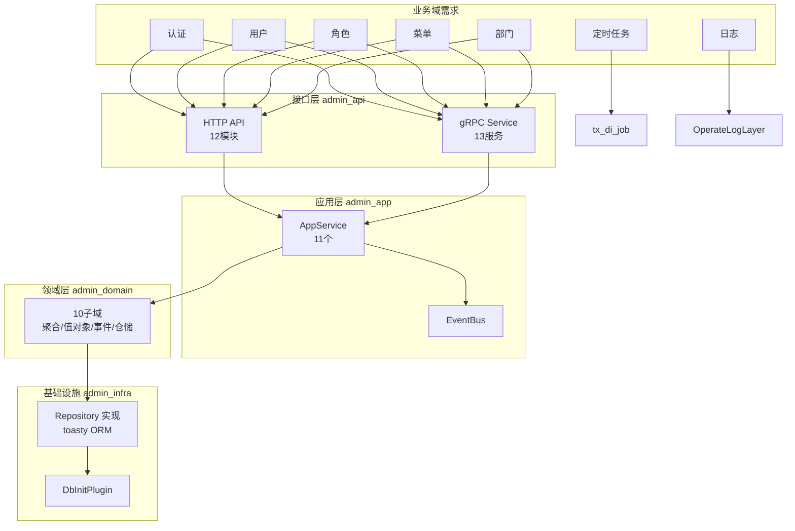

---

## 三、架构风格分析

架构风格是系统在宏观结构层面的**复用性决策**。tx_admin 并非单一风格，而是**以分层为骨架，多风格组合**的系统。本节逐一分析各风格及其在系统中的体现、适用性与权衡。

### 3.1 主风格：分层架构（Layered Architecture）+ DDD

**风格描述**：将系统划分为 4 个层次，依赖单向向下，上层依赖下层的抽象（依赖倒置）。

| 层次 | 对应 Crate | 职责 | 允许依赖 |
|------|-----------|------|----------|
| 接口层（Presentation） | `admin_api` | HTTP/gRPC 协议适配、认证、操作日志 | 应用层、proto、DI 插件 |
| 应用层（Application） | `admin_app` | 用例编排、DTO 转换、事务协调、事件发布 | 领域层、proto |
| 领域层（Domain） | `admin_domain` | 业务核心：聚合根/值对象/领域服务/仓储接口/事件 | 仅 admin_macros、tx_error、tx_common |
| 基础设施层（Infrastructure） | `admin_infra` | 仓储实现、ORM、种子数据 | 领域层、toasty |

**关键决策**：领域层**不依赖任何基础设施**（`admin_domain/Cargo.toml` 仅依赖 `admin_macros`/`tx_error`/`tx_common`），仓储以 **trait 定义在领域层、实现在基础设施层**，实现依赖倒置（DIP）。

**权衡**：
- ✅ 优点：职责清晰、可测试（领域层可用 mock 仓储单测）、易于水平扩展新域
- ⚠️ 缺点：请求需穿越多层，少量性能开销；分层过严时增删字段成本高（本系统用 proto 统一 DTO 缓解）

### 3.2 管道-过滤器（Pipe-and-Filter）/ 中间件链

**风格描述**：请求流经一串处理器（过滤器），每个过滤器完成单一横切关注点。

**体现**：axum 的 Tower 中间件层 + 操作日志/指标/认证过滤器。

```
HTTP Request → [MetricsLayer sort=5] → [api_log sort=10] → [OperateLogLayer sort=15]
             → [SaCheckLoginLayer] → [SaTokenLayer] → 路由 Handler
gRPC Request → [AuthLayer(Tower middleware)] → gRPC Service 方法
```

| 过滤器 | 层类型 | 关注点 |
|--------|--------|--------|
| `MetricsLayer` | HTTP（sort=5） | Prometheus 请求计数/耗时 |
| `api_log` | HTTP（sort=10） | 访问日志 |
| `OperateLogLayer` | HTTP（sort=15） | 业务操作日志（mpsc 异步落库） |
| `SaCheckLoginLayer` / `SaTokenLayer` | HTTP | 认证、token 校验、注入 login_id |
| `AuthLayer` | gRPC（tower middleware） | Bearer token 提取 + sa-token 验证 + RBAC |

**权衡**：
- ✅ 优点：横切关注点解耦、可插拔、顺序可控
- ⚠️ 缺点：层数过多增加每次请求开销；过滤器顺序需严格设计（本系统用 `sort` 控制）

### 3.3 事件驱动（Event-Driven）/ 发布-订阅

**风格描述**：组件通过发布/订阅异步消息解耦，实现最终一致性。

**体现**：
- `DomainEvent` 枚举定义在 `admin_domain/shared/model/mod.rs`，涵盖 User/Role/Menu/Dept/File/Config/Dict/Log/Job 事件
- 聚合根通过 `AggregateRoot::add_event()` 收集领域事件
- `DomainEventPublisher` trait 定义在领域层（`shared/event_publisher.rs`，依赖倒置）
- `EventBus`（`admin_app/event_bus.rs`）实现该 trait，`#[component(as_trait = dyn DomainEventPublisher)]` 注入
- 应用服务在事务提交后 `publish(events)` 投递，订阅者回调隔离异常

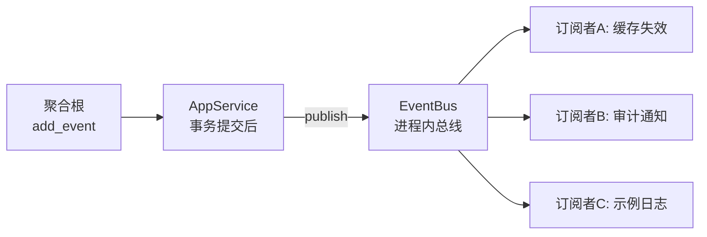

**权衡**：
- ✅ 优点：解耦生产/消费、便于异步化（缓存失效、审计、通知）
- ⚠️ 缺点：当前为**进程内同步投递**，非分布式；未来可演进为 Outbox 或分布式事件总线（接口不变）

### 3.4 插件 / 微内核架构（Plugin / Microkernel）

**风格描述**：核心系统提供 DI 容器与生命周期，功能以插件形式注册、可插拔。

**体现**：
- tx_di DI 框架本身即微内核：核心 `tx-di-core` 提供 `Store`/`App`/生命周期，各插件（log/cache/axum/toasty/sa_token/job/file/nacos）以 `#[derive(Component)]` 注册
- `admin_api` 的 `AdminPlugin`、`admin_infra` 的 `DbInitPlugin` 作为业务插件接入
- linkme 分布式切片实现编译期注册，插件需显式 `use` 触发
- 初始化顺序由 `init_sort` 控制

**权衡**：
- ✅ 优点：功能解耦、按需组装、独立演进
- ⚠️ 缺点：linkme 注册依赖链接器行为，**显式 `use` 缺失会导致静默失效**（已知陷阱）

### 3.5 依赖注入（Dependency Injection）

**风格描述**：组件不自行构造依赖，而是由容器注入，实现控制反转。

**体现**：所有 AppService、DomainService、Repository 实现均通过 `#[derive(Component)]` / `#[tx_comp]` 注册，Handler 用 `DiComp<T>` 提取器直接注入；仓储以 `Arc<dyn Trait>` 按接口注入。

```rust
#[derive(Component)]
pub struct UserAppService {
    user_service: Arc<UserService>,  // DI 注入
}
```

**权衡**：
- ✅ 优点：解耦、可测试、生命周期统一管理
- ⚠️ 缺点：增加编译期宏复杂度；DepsTuple ≤ 16 限制；依赖关系需拓扑排序

### 3.6 微服务架构（演进目标）

**风格描述**：系统按业务能力拆分为独立可部署服务。

**现状**：tx_admin 当前为**单服务**，但已为微服务化预留：`tx_di_nacos` 配置中心 + 服务注册 + `app_loop!` 优雅重启；`AdminEndpoints` 注册 HTTP/gRPC 到 Nacos。

**演进路径**（详见 docs/06）：
```
单体实例 → Nginx 负载均衡 → r-nacos 服务注册/配置中心 → 多实例水平扩展
          → 无状态化（sa-token Redis / 文件 S3 / Job 分布式锁）
```

**权衡**：
- ✅ 优点：水平扩展、故障隔离、独立部署
- ⚠️ 缺点：分布式一致性复杂、运维成本高；本系统当前以"单服务多实例"为务实目标

### 3.7 风格组合决策矩阵

| 架构风格 | 在系统中的地位 | 优先级 | 决策理由 |
|---------|--------------|--------|----------|
| 分层 + DDD | 主骨架 | ★★★★★ | 承载业务复杂度、依赖倒置 |
| 依赖注入 | 组装机制 | ★★★★★ | 解耦 + 生命周期统一 |
| 管道-过滤器 | HTTP/gRPC 横切 | ★★★★ | 认证/日志/指标横切关注点 |
| 插件/微内核 | 框架层 | ★★★★ | tx_di 生态可插拔 |
| 事件驱动 | 异步解耦 | ★★★ | 已实现事件总线，扩展中 |
| 微服务 | 演进目标 | ★★ | 当前单服务多实例，预留能力 |

---

## 四、SA模型确立

### 4.1 候选架构生成

基于需求空间与约束空间，架构师生成以下候选架构并比较：

| 候选架构 | 描述 | 优点 | 缺点 |
|---------|------|------|------|
| **C1 单体分层 + DI** | 四层 DDD 单体，DI 编译期组装 | 简单、性能好、易维护 | 无法水平扩展 |
| **C2 单体 + 事件驱动** | C1 + 领域事件总线 | 解耦、异步化 | 进程内总线，分布式需扩展 |
| **C3 单体 + 微服务预留** | C2 + Nacos 注册/配置中心 | 兼顾演进 | 引入注册中心复杂度 |
| **C4 完整微服务** | 按域拆分多服务 | 强隔离、独立扩展 | 过重，当前业务规模不匹配 |

### 4.2 权衡分析（Tactic-based）

| 质量属性 | 战术（Tactic） | C1 | C2 | C3 | C4 |
|---------|---------------|----|----|----|----|
| 安全性 | 认证/授权层、密码哈希 | ✅ | ✅ | ✅ | ✅ |
| 性能 | SQL 分页、异步 | ✅ | ✅ | ✅ | ⚠️ 网络开销 |
| 可扩展性 | 插件式 + DI | ✅ | ✅ | ✅ | ✅ |
| 可用性 | 优雅重启、故障转移 | ⚠️ 无 | ⚠️ 无 | ✅ | ✅ |
| 可部署性 | 配置化、容器化 | ✅ | ✅ | ✅ | ⚠️ 复杂 |

### 4.3 最终决策：C3（单体分层 + 事件驱动 + 微服务预留）

> **决策依据**：tx_admin 当前业务规模为单体应用，完整微服务（C4）会引入过度复杂度。选择 **C3**：以 DDD 分层单体为底座，内建事件驱动机制，并通过 Nacos 具备配置中心、服务注册、优雅重启能力，为平滑演进到多实例/微服务保留路径。

### 4.4 架构决策记录（ADR）

| ADR | 决策 | 状态 | 说明 |
|-----|------|------|------|
| ADR-001 | 从 Mock 仓储迁移到 Toasty ORM | ✅ Completed | `admin_infra` 实现全部 Repository |
| ADR-002 | Proto 生成类型作为传输 DTO | ✅ Accepted | HTTP 与 gRPC 共用 |
| ADR-003 | 从 OnceLock 迁移到 DI 原生注入 | ✅ Completed | 删除 `services.rs`，用 `DiComp<T>` |
| ADR-004 | sa-token 作为认证方案 | ✅ Accepted | JWT-like，Redis/内存会话 |
| ADR-005 | 领域层不依赖基础设施（DIP） | ✅ Accepted | Repository trait 定义在领域层 |
| ADR-006 | 事件总线进程内实现 | ✅ Accepted | 接口在领域层，可演进为分布式 |
| ADR-007 | 引入 Nacos 配置中心 + 服务注册 | ✅ Completed | `tx_di_nacos` + `app_loop!` |
| ADR-008 | gRPC 使用 Tower 中间件鉴权 | ✅ Accepted | `AuthLayer` |
| ADR-009 | 聚合根收集领域事件 + 事务后发布 | ✅ Accepted | `AggregateRoot::add_event` + `DomainEventPublisher` |
| ADR-010 | 采用 Argon2id 密码哈希 | ✅ Completed | 废弃明文比较 |

---

## 五、设计阶段

设计阶段将 SA 模型细化为可实施的蓝图，包括逻辑架构、进程架构、物理架构、数据架构与接口契约。

### 5.1 逻辑架构（Logical Architecture）

逻辑架构关注**模块与职责划分**，对应 4+1 的逻辑视图（详见第九节）。

#### 5.1.1 Crate 划分

```
tx_admin（Cargo workspace）
├── admin_api       # 接口层：HTTP/gRPC 适配、插件注册
├── admin_app       # 应用层：11 个 AppService + EventBus
├── admin_domain    # 领域层：10 子域 + shared
├── admin_infra     # 基础设施层：toasty Repository + DbInitPlugin + seed
├── admin_proto     # 传输层：proto 定义 + 生成 DTO
└── admin_macros    # 派生宏：AggregateRoot
```

#### 5.1.2 依赖方向（依赖倒置核心）

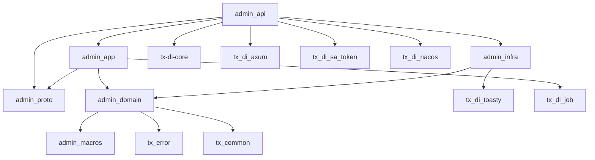

#### 5.1.3 分层依赖约束

| 规则 | 说明 |
|------|------|
| R1 | 领域层不依赖应用层/接口层/基础设施层 |
| R2 | 仓储接口定义在领域层，实现在基础设施层 |
| R3 | DTO 统一来自 `admin_proto`（gRPC 与 HTTP 共用） |
| R4 | 跨聚合操作由应用层编排，领域服务只持有单仓储 |
| R5 | 领域事件接口定义在领域层，实现在应用层 |

### 5.2 进程架构（Process Architecture）

进程架构关注**运行时进程、线程、并发模型**。

#### 5.2.1 进程与线程模型

```
进程：tx_admin（单个操作系统进程，一个 tokio 多线程运行时）
│
├── 运行时线程池（tokio worker）   # 处理 async 任务
│   ├── HTTP Server（axum）       # WebPlugin，监听 :port
│   ├── gRPC Server（tonic）      # AdminPlugin，监听 :50051
│   ├── 操作日志消费者任务          # mpsc::channel 消费端
│   ├── 定时任务调度（tx_di_job）   # Cron 触发 + 执行
│   └── async_run 并发后台任务
```

#### 5.2.2 并发与异步模型

| 组件 | 并发模型 |
|------|----------|
| HTTP 请求处理 | tokio 异步，每请求一 future |
| gRPC 请求处理 | tonic 异步，tower 中间件 |
| 操作日志 | `mpsc::channel` 生产-消费，避免阻塞请求路径 |
| 定时任务 | `tx_di_job` Cron 调度，独立执行 |
| `async_init` | 按 init_sort 串行执行（保证依赖就绪） |
| `async_run` | 并行 `tokio::spawn` 启动 |

> **关键**：所有组件必须是 `Send + Sync + 'static`，以支撑 tokio 多线程运行时跨线程迁移。

### 5.3 物理架构（Physical Architecture）

物理架构关注**部署节点、运行时环境**（详见第八节部署阶段）。

| 环境 | 部署形态 | 数据库 | 认证会话 | 文件存储 |
|------|---------|--------|----------|----------|
| 开发 | 本地 `cargo run -p admin_api` | SQLite | 内存会话 | 本地目录 |
| 测试 | Docker 单实例 | SQLite/PG | Redis | 本地 |
| 生产 | Docker 多实例 + Nginx + r-nacos | PostgreSQL | Redis | S3 |

### 5.4 数据架构（Data Architecture）

#### 5.4.1 聚合根与表映射

| 聚合根 | 领域模块 | toasty 模型（`admin_infra/<域>/model.rs`） | 关联 |
|--------|---------|------|------|
| `User` | `user/model/aggregate.rs` | `SysUser` + `SysUserRole` + `SysUserDept` | N:M 角色/部门 |
| `Role` | `role/` | `SysRole` + 菜单关联 | N:M 菜单 |
| `Menu` | `menu/` | `SysMenu` | 树 |
| `Department` | `department/` | `SysDept` | 树 |
| `Config` | `config/` | `SysConfig` | — |
| `DictType` / `DictData` | `dictionary/` | `SysDictType`/`SysDictData` | 1:N |
| `File` | `file/` | `SysFile` + `FileConfig` | — |
| `OperateLog` / `LoginLog` | `log/` | `SysOperateLog`/`SysLoginLog` | — |

#### 5.4.2 一致性策略

- **原子写**：多表写（建用户+绑角色+绑部门）用 `toasty_transaction!` 单事务
- **软删除**：所有聚合根支持 `DeletedStatus`，`deleted` 字段
- **审计**：`AuditFields`（creator/create_time/updater/update_time/deleted）贯穿所有聚合
- **ID**：雪花算法 `tx_common::id::next_id()`（分布式唯一）

#### 5.4.3 分页策略

- 用户/角色等列表：SQL 层 `toasty_page!` 宏（过滤 + COUNT + LIMIT/OFFSET），避免全表加载
- Job 列表：`find_job_page(name, status, page, page_size)` SQL 层分页（已修复原先的全量加载问题）

### 5.5 接口契约（Interface Contract）

#### 5.5.1 gRPC 接口（`admin_proto/protos/`）

| proto 文件 | Service | 说明 |
|-----------|---------|------|
| `auth.proto` | AuthService | Login/Logout/GetUserInfo |
| `user.proto` | UserService | 用户 CRUD |
| `role.proto` | RoleService | 角色 + 授权 |
| `menu.proto` | MenuService | 菜单树 |
| `department.proto` | DepartmentService | 部门树 |
| `config.proto` | ConfigService | 配置 |
| `dictionary.proto` | DictService | 字典 |
| `file.proto` | FileService | 文件 |
| `log.proto` | LogService | 日志 |
| `job.proto` | JobService + JobLogService | 任务 + 日志 |
| `monitor.proto` / `tool.proto` | Monitor/ToolService | 占位 |

#### 5.5.2 HTTP 接口（`admin_api/interfaces/api/`）

公开路由（无需认证）：`POST /api/auth/login`、`POST /api/auth/refresh`、`GET /files/**`。

受保护路由：`/api/auth/logout`、`/api/user/**`、`/api/role/**`、`/api/menu/**`、`/api/dept/**`、`/api/config/**`、`/api/dict/**`、`/api/log/**`、`/api/file/**`、`/api/job/**`、`/api/monitor/**`、`/api/tool/**`。

#### 5.5.3 序列化约定

- gRPC DTO 由 tonic-build 生成（`admin_proto/src/pb/`）
- i64/u64 字段经 `serde_with` 的 `DisplayFromStr` 序列化为 JSON 字符串，避免 JS 精度丢失
- 统一响应包装 `ApiR<T>`（`tx_common/src/api_r.rs`）
- 分页封装 `Page<T>`（`tx_common/src/page.rs`）

---

## 六、实现阶段

实现阶段将架构蓝图落地为可编译、可测试的代码。本节明确模块实现规范、命名约定、DI 生命周期实现与质量门禁。

### 6.1 模块实现规范

#### 6.1.1 领域层子域目录规范

每个子域统一按 DDD 战术模式组织：

```
admin_domain/src/<domain>/
├── mod.rs          # 模块导出
├── model/
│   ├── aggregate.rs     # 聚合根（#[derive(AggregateRoot)]）
│   ├── value_object.rs  # 值对象（枚举/结构体）
│   ├── event.rs         # 该域特定领域事件（如需）
│   ├── mod.rs
│   └── tests.rs         # 聚合根单元测试
├── repository/
│   └── mod.rs           # Repository trait（async_trait）
└── service/
    ├── mod.rs           # 领域服务（#[derive(Component)]）
    └── tests.rs
```

#### 6.1.2 聚合根实现要点

```rust
#[derive(Debug, Clone, Serialize, Deserialize, AggregateRoot)]
pub struct User {
    pub id: u64,
    // ... 业务字段
    events: Vec<DomainEvent>,  // 内部收集领域事件（不对外）
}

impl User {
    pub fn create(id, username, password, nickname, creator) -> Self {
        // 构造 + 业务不变量
        user.add_event(DomainEvent::UserCreated { ... });  // 收集事件
        user
    }
    pub fn verify_password(&self, plain: &str) -> bool { ... }  // 封装密码校验
}
```

**要点**：
- 聚合根业务方法改变状态的同时 `add_event` 收集领域事件
- 密码验证封装在聚合根内（`verify_password`），不暴露哈希细节
- 事件字段私有，通过 `AggregateRoot` trait 的 `events()`/`clear_events()` 读取

#### 6.1.3 仓储实现要点（`admin_infra`）

```rust
#[derive(Component)]
#[component(as_trait = dyn UserRepository)]
pub struct ToastyUserRepository {
    plugin: Arc<ToastyPlugin>,  // DI 注入
}

#[async_trait]
impl UserRepository for ToastyUserRepository {
    // toasty 查询 → to_domain() 转换为领域聚合
    // 多表写用 toasty_transaction! 保证原子性
}
```

**要点**：
- 仓储实现以 `as_trait = dyn XxxRepository` 注册，按接口注入
- toasty 模型（`SysUser`）与领域模型（`User`）通过 `to_domain()` 显式转换
- 分页用 `toasty_page!` 宏在 SQL 层完成过滤/计数/分页
- 多表写（建用户+绑角色+绑部门）用 `toasty_transaction!` 单事务

### 6.2 命名约定

| 类型 | 命名规则 | 示例 |
|------|---------|------|
| 聚合根 | 名词 | `User`, `Role`, `Menu` |
| 值对象 | 名词 + Query/Status/Type | `UserQuery`, `UserStatus` |
| Repository trait | 名词 + Repository | `UserRepository` |
| 领域服务 | 名词 + Service | `UserService` |
| 应用服务 | 名词 + AppService | `UserAppService` |
| Command DTO | 动词 + 名词 + Command | `CreateUserCommand` |
| Response DTO | 名词 + Response | `UserResponse` |
| HTTP Handler | 动词（小写下划线） | `create_user`, `get_role` |
| gRPC Service | 名词 + GrpcService | `UserGrpcService` |
| toasty 模型 | Sys + 名词 | `SysUser`, `SysRole` |
| 错误码 | 分类 + 唯一编号 | `RepositoryError`（1xxxx=DB/2xxxx=不存在/3xxxx=重复/4xxxx=校验） |

### 6.3 DI 生命周期实现

DI 生命周期是 tx_admin 运行时的核心机制，各阶段实现如下：

```
1. #[derive(Component)] → codegen → linkme 注册条目（COMPONENT_REGISTRY）
2. BuildContext::with_config(toml) → 拓扑排序 → 注册工厂
3. BuildContext::build() → 创建 App
4. App::ins_run()：
   a. init()        — 同步初始化（按 init_sort）
   b. async_init()  — 异步初始化（按 init_sort，串行）
   c. comp_run()    — 并行启动所有 async_run 组件
5. App::graceful_shutdown() / waiting_exit()
```

#### 6.3.1 初始化排序常量

| 排序值 | 组件 | 职责 |
|--------|------|------|
| `i32::MIN` | tx_di_log | tracing 订阅者（必须最先） |
| `i32::MIN+1` | Config 组件 | 各插件配置 |
| `i32::MIN+2` | tx_di_toasty | ORM 连接 |
| `i32::MIN+3` | tx_di_file | 文件存储 |
| `i32::MAX-200` | DbInitPlugin | 注册 toasty 模型 + 种子数据 |
| `i32::MAX-100` | AdminPlugin | 注册 HTTP/gRPC 路由、启动 gRPC |
| 默认 | WebPlugin | 启动 HTTP 服务器 |

#### 6.3.2 关键生命周期回调

| 组件 | 生命周期标志 | 回调 | 职责 |
|------|------------|------|------|
| `DbInitPlugin` | `init` | `fn init(&mut self, store)` | 注册 toasty 模型 |
| `DbInitPlugin` | `app_async_init` | `async fn` | Schema 迁移 + 种子数据 |
| `AdminPlugin` | `app_async_init` | `async fn` | 注册中间件 Layer、HTTP/gRPC 路由、启动 gRPC、事件订阅 |

```rust
#[derive(Component)]
#[component(app_async_init, init_sort = i32::MAX - 100)]
pub struct AdminPlugin;
```

### 6.4 依赖注入组装示例

```rust
// Handler 层：DiComp 提取器自动注入
async fn create_user(
    DiComp(svc): DiComp<UserAppService>,
    Json(req): Json<CreateUserRequest>,
) -> Result<ApiR<UserResponse>, ApiErr> {
    svc.create_user(req.into(), get_login_id()).await
}

// 应用服务：DI 注入领域服务与仓储
#[derive(Component)]
pub struct UserAppService {
    user_service: Arc<UserService>,
    role_service: Arc<RoleService>,
    dept_service: Arc<DepartmentService>,
}
```

### 6.5 质量门禁（Quality Gate）

| 门禁 | 命令 | 说明 |
|------|------|------|
| 编译 | `cargo check -p admin_api` | 快速编译检查 |
| 单元测试 | `cargo test -p admin_app -p admin_domain` | 聚合根/服务/仓储测试 |
| 集成测试 | `cargo test -p admin_api -- --test-threads=1` | 共享二进制需串行 |
| Lint | `cargo clippy` | 静态检查 |
| 格式化 | `cargo fmt --check` | 代码风格 |

---

## 七、构建组装阶段

构建组装阶段描述**代码如何被编译、依赖如何被注入、组件如何被装配**成可运行系统。

### 7.1 Cargo Workspace 构建

tx_admin 属于 `examples/tx_admin` 下的独立 workspace 片段（各 crate 有自己的 `Cargo.toml`）。核心构建链路：

```bash
# 生成 proto 代码（admin_proto/build.rs，tonic-build + protoc_bin_vendored）
# 编译各 crate
cargo build -p admin_api --release
```

**构建产物**：
- `admin_proto/src/pb/*.rs`：由 build.rs 从 `protos/*.proto` 生成
- 各 crate 编译为 `.rlib`/bin，最终链接为一个可执行文件 `admin_api`

### 7.2 DI 组件注册与装配（linkme 分布式切片）

#### 7.2.1 注册机制

tx-di-macros 的 `#[derive(Component)]` 通过 `linkme` 的 `distributed_slice` 在编译期将组件元数据注册到 `COMPONENT_REGISTRY`：

```
编译期：#[derive(Component)] → codegen/meta_entry.rs → linkme 分布式切片
运行时：BuildContext::with_config() → auto_register_all() → topo_sort() → register_factory()
```

#### 7.2.2 显式 use 注册（linkme 陷阱）

插件 crate 必须在使用方显式 `use`（空导入）触发注册，否则被链接器优化掉：

```rust
// admin_api/src/lib.rs
#[allow(unused_imports)]
use {
    admin_app, admin_infra, tx_di_axum, tx_di_file, tx_di_job, tx_di_log,
    tx_di_sa_token, tx_di_toasty,
};
```

> ⚠️ **架构约束**：任何新增插件都必须在此显式 `use`，否则组件静默失效。

### 7.3 应用组装流程（`main.rs` + `app_loop!`）

```rust
#[tokio::main]
async fn main() -> AppResult<()> {
    tx_di_nacos::app_loop! {
        config = r"examples/tx_admin/config/config.toml",
        startup = |app: Arc<tx_di_core::App>| -> RIE<()> {
            // 注册内置 Job Handler（noop / echo）
            let job_plugin = app.inject::<JobPlugin>();
            job_plugin.register_handler("noop", |_| JobResult{...});
            job_plugin.register_handler("echo", |param| JobResult{...});
            Ok(())
        },
    }
}
```

**`app_loop!` 组装流程**：
1. 读取本地 `config.toml`（bootstrap 层）
2. 若 `[registry_config] enabled=true`，从 Nacos 拉取远程配置并深合并（远程覆盖本地）
3. `BuildContext::with_config(merged)` → `build()` 创建 App
4. `ins_run()` 完成 init + async_init + comp_run
5. 收集端点（`take_endpoints`）注册到 Nacos
6. 执行 `startup` 闭包（Job handler 注册等）
7. 监听退出信号 / 配置变更 → 优雅关闭（进程不退出）→ 新配置重启

### 7.4 配置装配（config.toml）

```toml
[web_config]
port = 8888
host = "::"

[toasty_config]
database_url = "sqlite:examples/tx_admin/data/tx_admin.db"
auto_schema = false
migrate_on_start = true

[sa_token]
timeout = 86400
token_name = "Authorization"

[job_config]
enabled = true
poll_interval_secs = 1

[file_config]
backend = "local"
base_path = "./uploads"

[registry_config]
enabled = false                    # 本地运行时关闭 Nacos
nacos_addr = "http://127.0.0.1:8848"
service_name = "tx-admin"
```

**配置层次**：本地 bootstrap → Nacos 远程（深合并，远程优先）。

### 7.5 端点注册（Nacos）

```rust
// admin_api/nacos.rs
impl EndpointProvider for AdminEndpoints {
    fn get_endpoints(&self) -> Vec<ServiceEndpoint> {
        vec![
            ServiceEndpoint { protocol: Protocol::Http, ip, port: http_port, .. },
            ServiceEndpoint { protocol: Protocol::Grpc, ip, port: grpc_port, metadata: grpc_meta },
        ]
    }
}
```

`AdminPlugin` 在 `app_async_init` 中调用 `register_endpoints(Arc::new(AdminEndpoints::new(http_port, grpc_port)))`，`app_loop!` 在启动完成后统一 `take_endpoints` 并注册到 Nacos。

---

## 八、部署阶段

部署阶段将构建产物部署到目标环境。tx_admin 支持从本地单机到微服务多实例的部署形态。

### 8.1 部署拓扑（现状：单服务多实例）

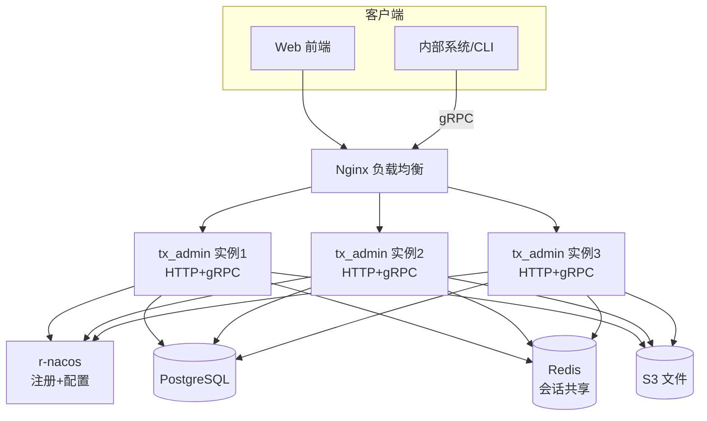

### 8.2 部署形态矩阵

| 形态 | 适用场景 | 数据库 | 会话 | 文件 | 启动方式 |
|------|---------|--------|------|------|----------|
| 本地开发 | 开发调试 | SQLite | 内存 | 本地 | `cargo run -p admin_api` |
| Docker 单实例 | 测试/演示 | SQLite/PG | Redis | 本地/S3 | `docker-compose` |
| 多实例 + Nacos | 生产 | PostgreSQL | Redis | S3 | `docker-compose up --scale tx_admin=3` |

### 8.3 环境配置

| 环境变量 | 作用 | 默认 |
|---------|------|------|
| `CONFIG_PATH` | 本地配置路径 | `config/config.toml` |
| `SERVICE_IP` | 注册到 Nacos 的 IP（容器/多网卡必须） | `127.0.0.1` |
| `GRPC_PORT` | gRPC 监听端口 | `50051` |
| `NACOS_SERVER_ADDR` | r-nacos 地址 | 配置节内 |

### 8.4 无状态化（水平扩展前提）

| 改造项 | 方案 | 状态 |
|--------|------|------|
| 会话共享 | sa-token 会话存 Redis | ✅ 支持（`tx_di_sa_token`） |
| 文件上传 | S3 兼容存储（`tx_di_file`） | ✅ 支持 |
| 定时任务 | Redis 分布式锁防重复执行 | ⏳ 待实施（P2） |
| 配置 | Nacos 配置中心 | ✅ 已实施（`tx_di_nacos`） |
| 服务注册 | Nacos 自动注册/心跳/摘除 | ✅ 已实施 |

### 8.5 健康检查与故障转移

| 检查 | 端点 | 目的 |
|------|------|------|
| 存活 liveness | `GET /health/live` | 进程是否存活 |
| 就绪 readiness | `GET /health/ready` | 是否可接受流量 |
| 健康 health | `GET /health` | r-nacos 探测 |

**故障转移流程**：
1. r-nacos 定期探测健康端点
2. 探测失败 → 自动摘除该实例
3. 流量转发到健康实例（Nginx 负载均衡）
4. Docker `restart: unless-stopped` / K8s `livenessProbe` 自动重启

### 8.6 部署运维检查清单

| 检查项 | 说明 |
|--------|------|
| 配置注入 | 通过环境变量 / Nacos，避免硬编码 |
| 注册 IP | 容器环境必须设置 `SERVICE_IP` |
| 数据库 | `migrate_on_start=true` 受控迁移，`auto_schema` 生产关闭 |
| 密钥管理 | Nacos 账号密码、DB 密码通过密钥管理注入 |
| 可观测性 | tracing 日志 + Prometheus 指标（MetricsLayer） |
| 优雅停机 | `app_loop!` 保证配置变更/退出信号优雅重启 |

---

## 九、4+1视图

4+1 视图模型（Kruchten）从**五个视角**刻画系统，覆盖不同干系人的关注点。本节给出逻辑、进程、开发、物理四个静态视图，以及一个贯穿各视图的场景视图。

### 9.1 视图总览对照表

| 视图 | 关注点 | 主要干系人 | 对应章节 |
|------|--------|-----------|----------|
| **逻辑视图** | 功能分解、模块职责、类/组件结构 | 架构师、开发 | 9.2 |
| **进程视图** | 运行时并发、线程、进程间交互 | 架构师、运维 | 9.3 |
| **开发视图** | 源码组织、Crate 划分、依赖管理 | 开发、测试 | 9.4 |
| **物理视图** | 部署节点、硬件、网络拓扑 | 运维、架构师 | 9.5 |
| **场景视图** | 关键用例的端到端流程 | 全部 | 9.6 |

### 9.2 逻辑视图（Logical View）

逻辑视图展现系统的**功能分解与组件职责**，即 DDD 四层结构及其依赖关系。

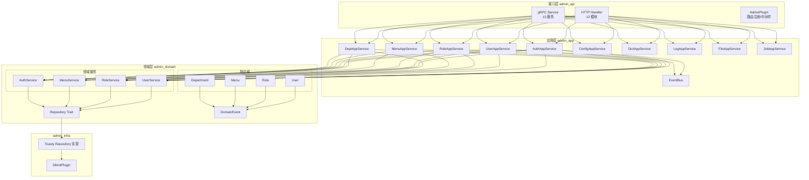

**依赖方向**：`接口层 → 应用层 → 领域层 ⇠ 基础设施层`（依赖倒置，仓储接口在领域层）。

### 9.3 进程视图（Process View）

进程视图展现**运行时进程/线程结构与组件间通信**。

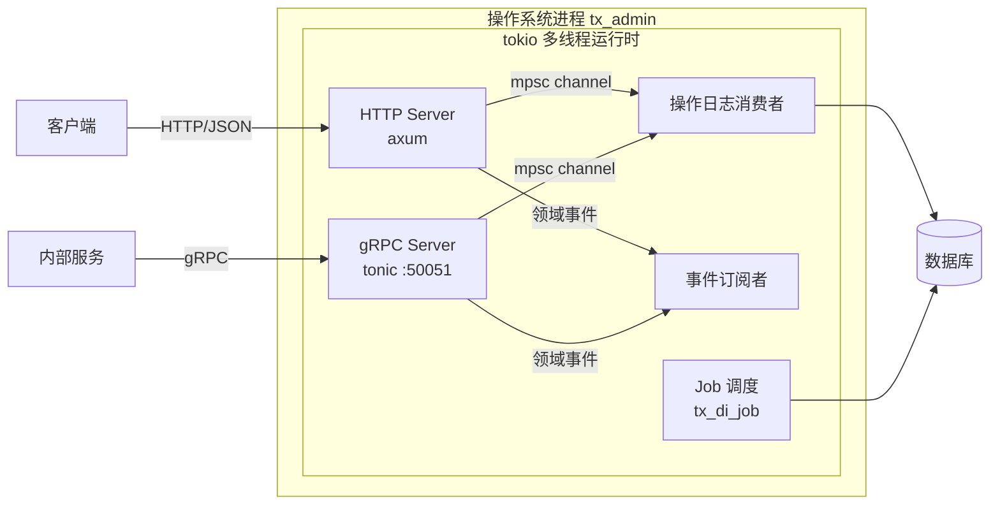

**进程关键特性**：
- 单进程、单 tokio 运行时，HTTP/gRPC/Job/事件订阅并行共处
- 操作日志通过 `mpsc::channel` 异步解耦，请求路径不阻塞
- 领域事件通过 `EventBus` 同步投递（订阅者内部可 `tokio::spawn` 异步化）
- 所有后台任务为 `async_run` 并发启动

### 9.4 开发视图（Development View）

开发视图从**源码组织与构建单元**角度刻画系统，即 Crate 依赖图与模块划分。

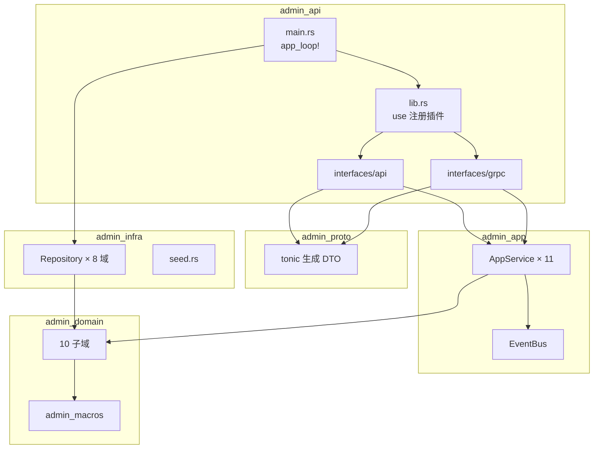

**开发规范**（详见第六节）：命名约定、领域子域目录、聚合根/仓储模式、质量门禁。

### 9.5 物理视图（Physical View）

物理视图展现**部署拓扑**（已在第八节详述），此处给出简化的节点-进程-组件映射。

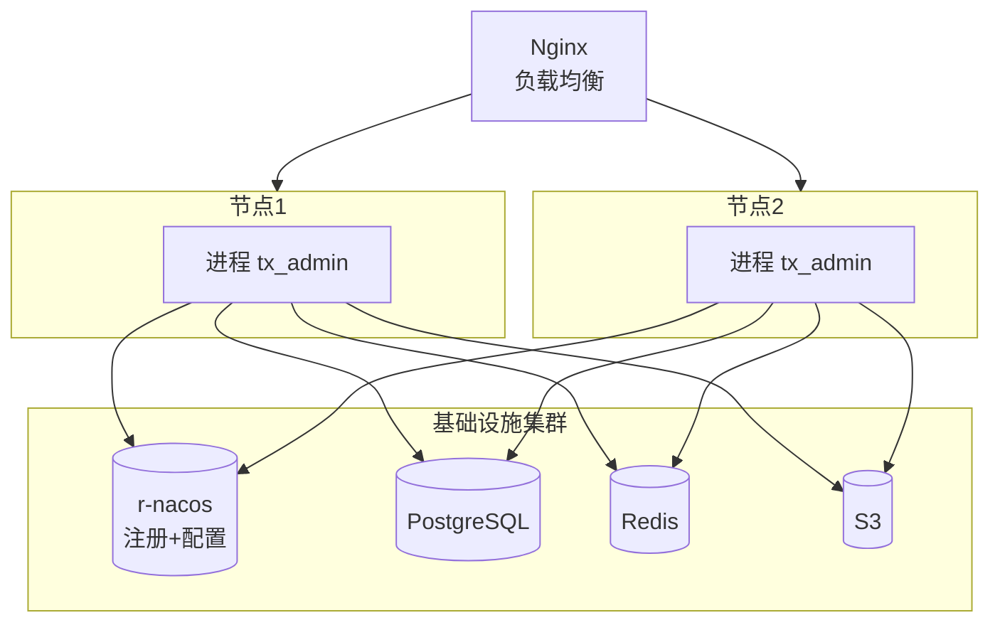

**部署要点**：无状态进程 + 共享基础设施（PG/Redis/S3/Nacos）→ 水平扩展与故障转移。

### 9.6 场景视图（Scenario View）

场景视图以**关键端到端用例**串联其他四个视图，是最有力的架构验证手段。以下为四个典型场景。

#### 场景 A：登录认证

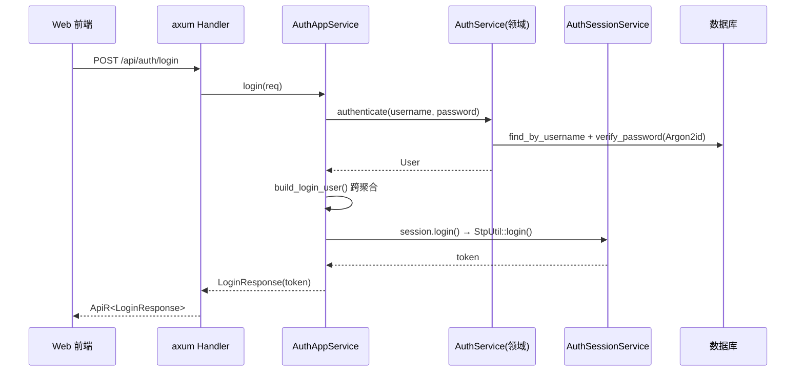

**涉及视图**：逻辑（应用服务/领域服务）、进程（HTTP 请求路径）、场景。

#### 场景 B：创建用户

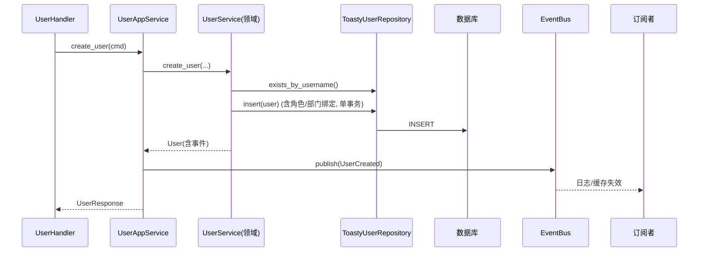

**要点**：聚合根 `User::create()` 收集 `UserCreated` 事件，应用层事务提交后发布到 `EventBus`。

#### 场景 C：操作日志（HTTP 请求）

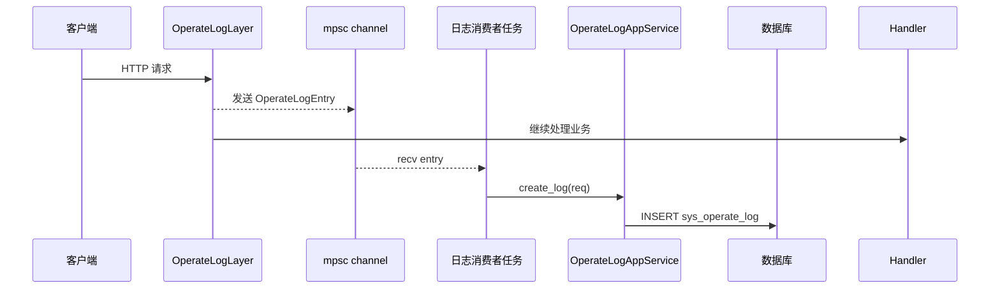

**要点**：`OperateLogLayer`（sort=15）采集请求元数据 → mpsc 异步通道 → 消费者落库，不阻塞请求路径。

#### 场景 D：定时任务执行

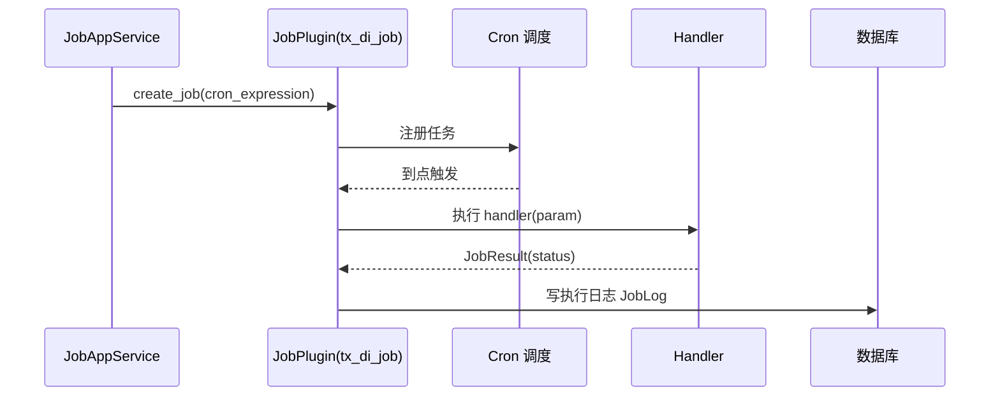

**要点**：`JobAppService` 基于 `tx_di_job`，Handler（如 `noop`/`echo`）在 `startup` 闭包中注册。

---

## 十、质量属性与架构级改进

本节基于架构视角，对已知问题给出**架构级**改进方向（区别于代码级修复）。

### 10.1 质量属性当前状态评估

| 质量属性 | 现状 | 支撑机制 | 改进空间 |
|---------|------|----------|----------|
| 安全性 | 良好 | sa-token + RBAC + Argon2id | gRPC 401 响应体规范化 |
| 性能 | 良好 | SQL 分页、异步 mpsc、tokio | 查询索引、缓存策略 |
| 可扩展性 | 良好 | DI + DDD 分层 | 新增域工作量 |
| 可用性 | 良好 | Nacos 优雅重启 + 故障转移 | Job 分布式锁 |
| 可维护性 | 良好 | DDD + 命名规范 | 事件驱动完善 |
| 可观测性 | 中等 | tracing + MetricsLayer | OpenTelemetry 链路追踪 |
| 可部署性 | 良好 | 配置化 + Nacos | API 版本管理 |

### 10.2 架构级改进建议（按优先级）

#### P0：领域事件驱动的完善（事件驱动落地）

**现状**：聚合根已收集事件、`EventBus` 已实现并订阅，但仅用于示例日志，未发挥业务价值。

**架构建议**：
- 将**缓存失效**、**审计通知**、**跨域联动**接入事件订阅
- 引入 **Outbox 模式**：事务内写事件表 + 事务后发布，保证事件与业务操作一致性
- 未来可演进为**分布式事件总线**（Kafka/RabbitMQ），`DomainEventPublisher` 接口不变

#### P1：全链路可观测性（OpenTelemetry）

**现状**：有 tracing 日志 + MetricsLayer，但缺跨 HTTP/gRPC/DB 的分布式链路追踪。

**架构建议**：
- 引入 `tracing-opentelemetry` + OTLP，统一 trace_id 贯穿 HTTP/gRPC 中间件、应用服务、仓储
- 指标通过 Prometheus 暴露（MetricsLayer 已具备）
- 操作日志的 `trace_id` 字段（`CreateOperateLogRequest.trace_id`）可承接链路 ID

#### P2：API 版本管理

**现状**：HTTP/gRPC 路由无版本前缀，演进困难。

**架构建议**：
- HTTP：`/api/v1/**` 前缀，gRPC 用包版本 `admin.auth.v1`
- 兼容策略：`/api/v1` 冻结后新增 `/api/v2`，双版本并存窗口

#### P3：Job 分布式锁

**现状**：多实例部署时定时任务可能重复执行。

**架构建议**：基于 Redis 的分布式锁（SETNX + 过期），`tx_di_job` 执行前获取锁，失败跳过。

#### P4：查询性能优化

**架构建议**：
- 热数据加缓存层（`tx_di_cache`）：权限、字典、配置
- 列表查询建复合索引（`deleted + username`、`deleted + status` 等）
- 大数据量日志采用分库分表或时序库归档

#### P5：安全加固

**架构建议**：
- gRPC 401 返回标准 `Status::unauthenticated` 而非空 body
- 敏感配置（DB 密码、Nacos 凭据）通过密钥管理注入
- 增加接口限流、防刷（RateLimit Layer）

### 10.3 已解决的问题（回归确认）

| 问题 | 状态 | 说明 |
|------|------|------|
| 密码明文比较（P2） | ✅ 已解决 | Argon2id `password::hash_password` / `verify_password` |
| Job 列表全量加载（M2/L7） | ✅ 已解决 | `find_job_page` SQL 层分页 |
| User 分页全量加载（L7） | ✅ 已解决 | `toasty_page!` 宏 SQL 层分页 |
| 配置路径硬编码（P1） | ✅ 已改为相对路径 + Nacos | `examples/tx_admin/config/config.toml` |

---

## 十一、架构演进路线与附录

### 11.1 架构演进路线图

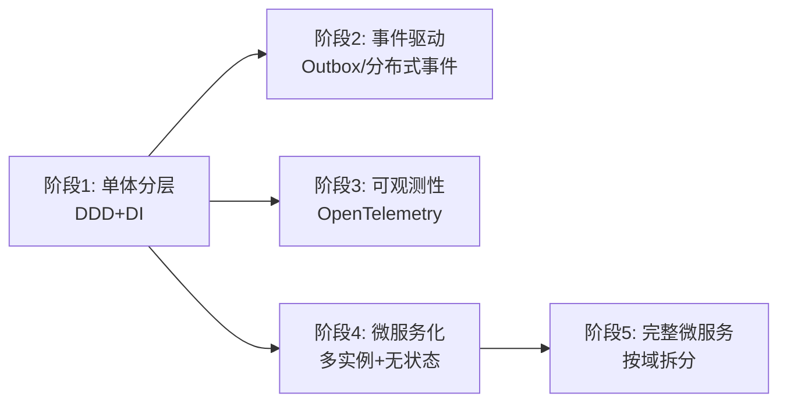

| 阶段 | 内容 | 优先级 | 依赖 |
|------|------|--------|------|
| 1（已完成） | DDD 单体 + DI + 双协议 + Nacos 预留 | — | — |
| 2 | 领域事件业务化（缓存失效/审计）+ Outbox | P0 | EventBus 已就绪 |
| 3 | OpenTelemetry 全链路追踪 | P1 | MetricsLayer 已就绪 |
| 4 | Job 分布式锁 + sa-token Redis + S3 | P1-P2 | Nacos 已就绪 |
| 5 | API 版本化 + 按域拆分微服务 | P3 | 业务规模驱动 |

### 11.2 ADR 汇总

| ADR | 决策 | 状态 |
|-----|------|------|
| ADR-001 | Toasty ORM 迁移 | Completed |
| ADR-002 | Proto 类型作传输 DTO | Accepted |
| ADR-003 | DI 原生注入 | Completed |
| ADR-004 | sa-token 认证 | Accepted |
| ADR-005 | 领域层不依赖基础设施 | Accepted |
| ADR-006 | 事件总线进程内实现 | Accepted |
| ADR-007 | Nacos 配置中心 + 注册 | Completed |
| ADR-008 | gRPC Tower 中间件鉴权 | Accepted |
| ADR-009 | 聚合根收集 + 事务后发布事件 | Accepted |
| ADR-010 | Argon2id 密码哈希 | Completed |

### 11.3 术语表

| 术语 | 定义 |
|------|------|
| SA | 软件架构，系统的总体结构及其设计决策 |
| DDD | 领域驱动设计 |
| 聚合根 | 一致性边界的根实体 |
| 限界上下文 | DDD 战略设计的业务边界 |
| QAS | 质量属性场景，可度量的质量需求 |
| DI | 依赖注入 |
| linkme | 编译期分布式切片注册库 |
| DepsTuple | DI 框架的依赖元组（上限 16） |
| RIE | `Result<T, AppError>`，统一错误 |
| AppService | 应用服务，用例编排 |
| Repository | 仓储，封装持久化 |
| init_sort | 组件初始化排序（值越小越先） |

### 11.4 文档版本历史

| 版本 | 日期 | 变更说明 |
|------|------|----------|
| v1.0 | 2026-08-10 | 初稿：从需求空间到 SA 模型，四大阶段 + 4+1 视图 + 架构风格 |

---

**— 本文档由系统架构师基于 tx_admin 最新代码编制，作为系统演进、评审与培训的架构基准。**
